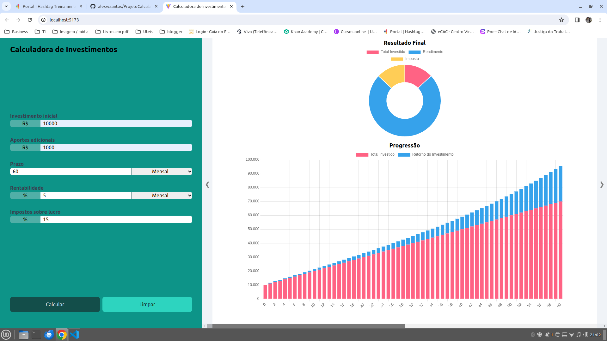
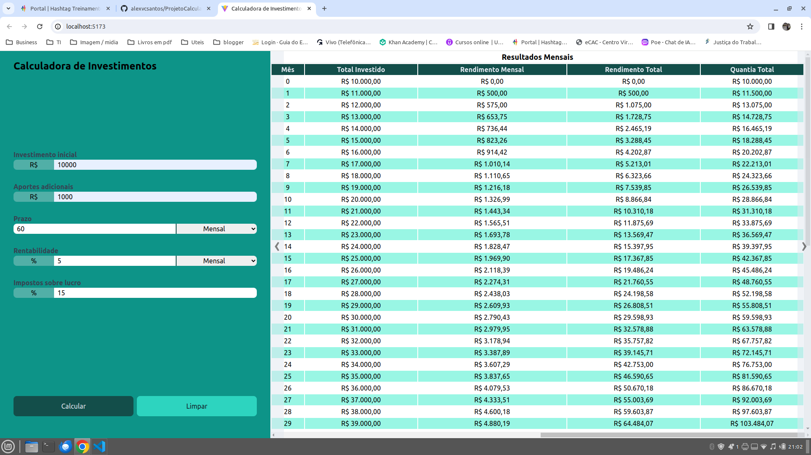

<h1 align="center"> Projeto Calculadora de Investimentos </h1>

Projeto de Calculadora de Investimentos. Desenvolvido em curso da <a href="https://portalhashtag.com/">HashTag Treinamentos</a> 

  <a href="#-tecnologias">Tecnologias</a>&nbsp;&nbsp;&nbsp;|&nbsp;&nbsp;&nbsp;
  <a href="#-projeto">Projeto</a>&nbsp;&nbsp;&nbsp;|&nbsp;&nbsp;&nbsp;
  <a href="#memo-licença">Licença</a>

  

 

  

  

## 🚀 Tecnologias

Esse projeto foi desenvolvido com as seguintes tecnologias:

-   HTML e CSS
-   JavaScript
-   Git e Github
-   tailwind CSS
-   Vitejs

## 💻 Projeto

Esse projeto é uma Calculadora de Investimentos, desenvolvido em curso da HashTag.

-   [Acesse o projeto finalizado, online](https://alexvcsantos.github.io/ProjetoCalculadoraInvestimentos/)

## :memo: Licença

Esse projeto está sob a licença MIT.

---

Feito com ♥ by Alex Victor :wave:
